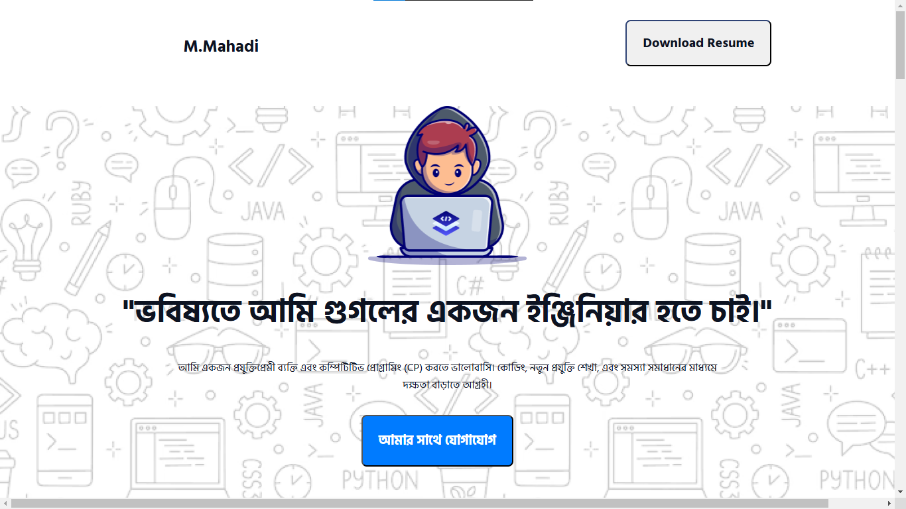
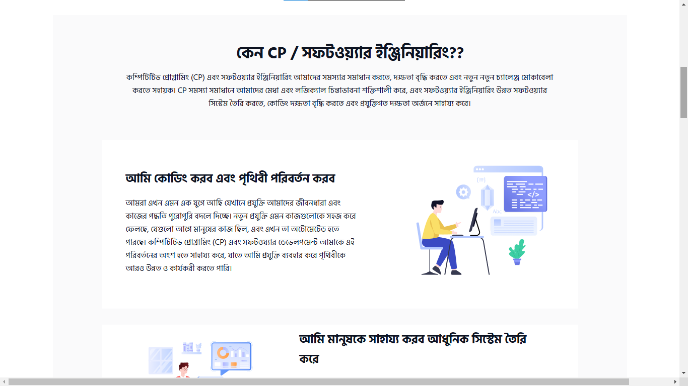
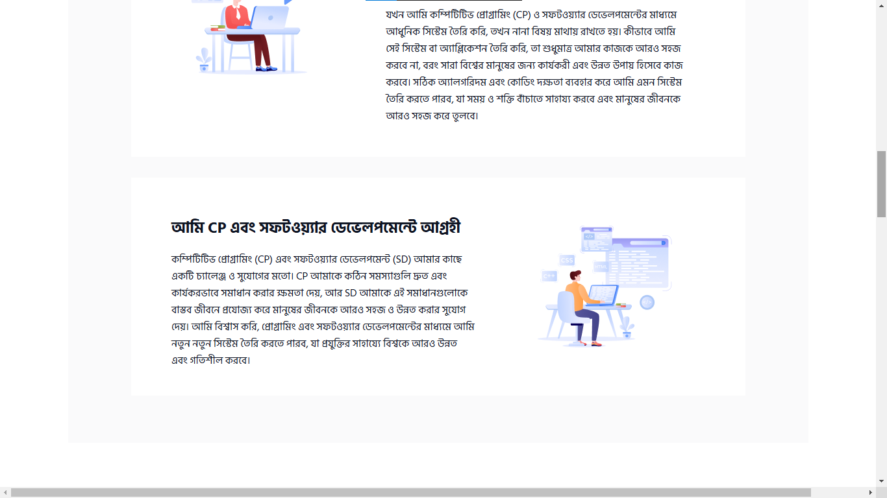
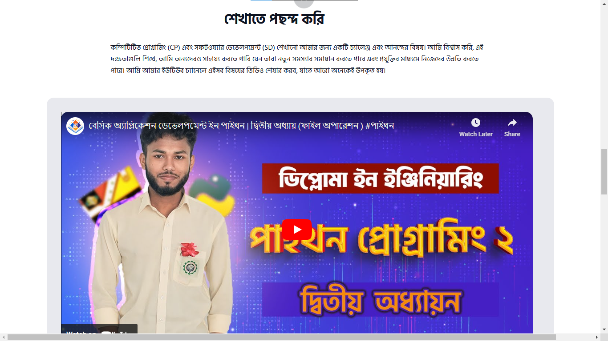
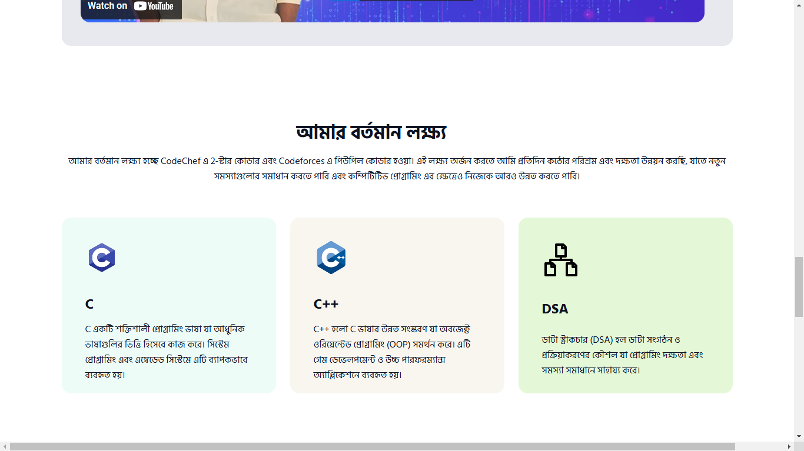
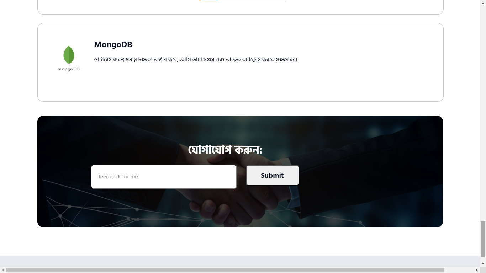
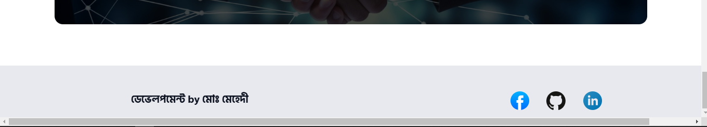

# মেহেদী - লাইফ স্টাইল
---
## পরিচিতি
"মেহেদী  লাইফ স্টাইল" একটি ব্যক্তিগত ওয়েবসাইট যা একজন সফটওয়্যার ইঞ্জিনিয়ারের যাত্রা, লক্ষ্য, এবং ভবিষ্যৎ পরিকল্পনার বর্ণনা দেয়।

---

## বৈশিষ্ট্য:
### হেডার:
- **নেভিগেশন বার**: "M.Mahadi" নাম এবং একটি রিজ্যুম ডাউনলোড বোতাম।
- **ইন্ট্রোডাকশন সেকশন**: একজন প্রযুক্তিপ্রেমীর স্বপ্ন এবং বর্তমান অবস্থান।

### প্রধান বিষয়বস্তু:
1. **কেন CP/সফটওয়্যার ইঞ্জিনিয়ারিং?** 
   - সমস্যার সমাধান এবং দক্ষতা বাড়ানোর সুবিধা নিয়ে আলোচনা।
2. **লক্ষ্য এবং অনুপ্রেরণা**:
   - পৃথিবী পরিবর্তনের পরিকল্পনা এবং মানুষের জন্য আধুনিক সিস্টেম তৈরির ইচ্ছা।
3. **কোডিং শেখার সুবিধা**:
   - শেখার মাধ্যমে অন্যদের সাহায্য করার লক্ষ্যে তৈরি করা ভিডিও কন্টেন্ট।
4. **বর্তমান লক্ষ্য এবং ভবিষ্যৎ পরিকল্পনা**:
   - বর্তমান লক্ষ্য CodeChef এ 2-স্টার এবং Codeforces এ পিউপিল হওয়া।
   - ভবিষ্যতে ব্যাকএন্ড ডেভেলপমেন্ট ও কৃত্রিম বুদ্ধিমত্তা (AI) শিখতে আগ্রহী।

### যোগাযোগ:
- একটি ফিডব্যাক ফর্ম যেখানে দর্শকরা তাদের মন্তব্য জমা দিতে পারে।

---
## স্ক্রিনশট:








---
## প্রযুক্তি
- **HTML5**: ওয়েবপেজের স্ট্রাকচার।
- **CSS3**: স্টাইলিং এবং ডিজাইন।
- **JavaScript**: ফাংশনালিটি।
- **Font**: হিন্দি শিলিগুড়ি।

---

## ব্যবহার
1. এই প্রজেক্ট ক্লোন করুন:
   ```bash
   git clone https://github.com/brownspy1/Project-for-EDGE.git
